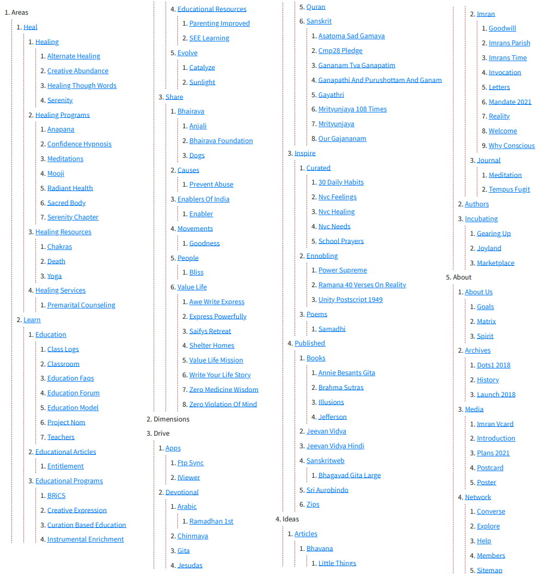

The [YieldMore.org Archives](https://archives.yieldmore.org/), archived in 2022 June contains the [100 odd articles](https://archives.yieldmore.org/sitemap/) we published the previous year. Of note are

* [Serenity with our Affirmations's program launch c 2019](https://archives.yieldmore.org/serenity/)
* [A writeup from Mar 2020](https://archives.yieldmore.org/creative-abundance/)
* [A list on Alternate Healing](https://archives.yieldmore.org/alternate-healing/)

This video of our launch in March 2018.

<iframe width="560" height="315" src="https://www.youtube.com/embed/EiJErn0LPYQ" title="YouTube video player" frameborder="0" allow="accelerometer; autoplay; clipboard-write; encrypted-media; gyroscope; picture-in-picture" allowfullscreen></iframe>

## Serenity

Basic questions of the create-your-affirmation program

1. Meet any counsellor and ask them to help you change your thinking vocabulary. Remove the negative impressions and thoughts, think hard about your wellness in all facets namely Physical, Intellectual, Emotional, Spiritual, Professional, Financial, Environmental & Social. Lay out in clear words what motivates you, what your goals are, how your working to get them, what gives you peace of mind.
2. Then record these words and play them back to yourself everyday until your convictions are marrow deep / you feel it in your gut. The affirmations template runs as follows:
  * My core values are...
  * My values are...
  * I live for...
  * My qualitative goals include...
  * I am unique in that I...
  * My relation to a higher purpose or God is that...
3. When you affirm life, you will realize that we live not alone. We live in the lap of God. And God has many children, both sentient and non-sentient.

	(Picture of Archives' Sitemap) 
	

